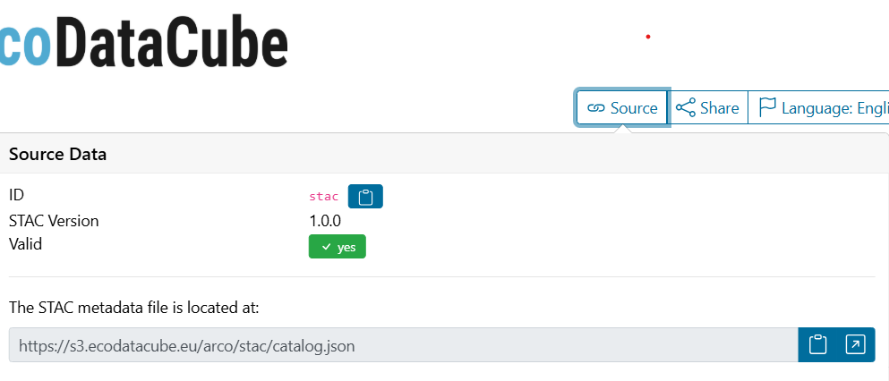
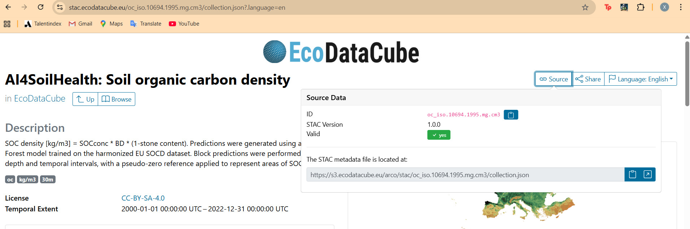
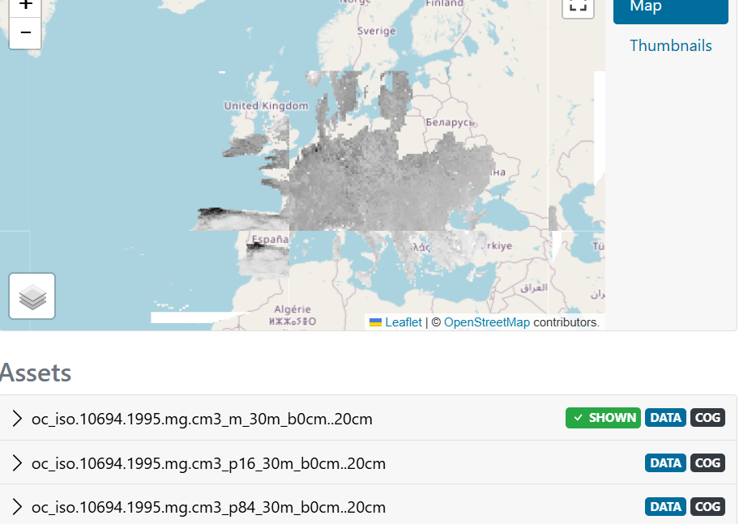
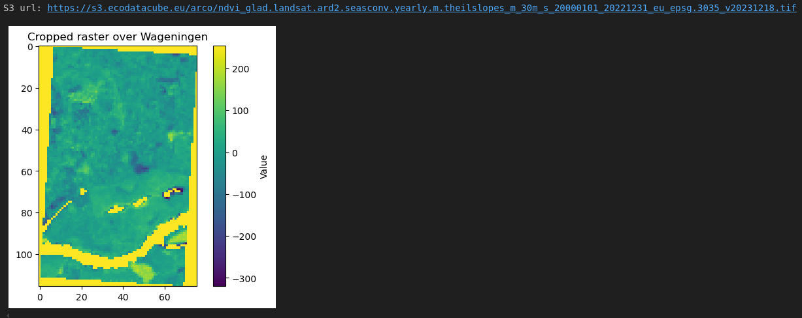

```{css, echo=FALSE}
@import url("https://netdna.bootstrapcdn.com/bootswatch/3.0.0/simplex/bootstrap.min.css");
.main-container {max-width: none;}
div.figcaption {display: none;}
pre {color: inherit; background-color: inherit;}
code[class^="sourceCode"]::before {
  content: attr(class);
  display: block;
  text-align: right;
  font-size: 70%;
}
code[class^="sourceCode r"]::before { content: "R Source";}
code[class^="sourceCode python"]::before { content: "Python Source"; }
code[class^="sourceCode bash"]::before { content: "Bash Source"; }
```

<font size="6">[WUR Geoscripting](https://geoscripting-wur.github.io/)</font> 

# SpatioTemporal Asset Catalog (STAC)

## Learning objectives

- Learn the concept of STAC
- Learn the basic components of STAC and how are they usually organized
- Learn how to find and access online resources via STAC


## Why STAC is needed

Before diving into STAC itself, let’s first take a look at the messy world of geospatial data.

Geospatial data (geo data) is simply any piece of information linked to a specific location on Earth. The concept sounds straightforward, but when it comes to capturing, storing, and sharing this information in the real world—especially in computers—it quickly becomes complicated. Why? Because geospatial data comes with many dimensions.

Take the simplest case: a single value (temperature, tree species, population density, etc.) associated with a geographic location (latitude and longitude). Now, the Earth isn’t flat—it’s 3D—so if the phenomenon you care about depends on altitude (like oxygen concentration or air temperature), you need an extra dimension for elevation. And things get trickier when you add time into the mix: many datasets track changes over days, months, or decades.

On top of that, you might not just have one variable to store, but dozens or even hundreds (e.g., different spectral bands in satellite imagery, or multiple measured parameters at the same site). How to organize this information depends on your purpose and use case—whether as a table, a time series, or a set of raster images.

And here’s another wrinkle: different organizations often have their own way of storing, naming, and publishing geospatial data. File formats, folder structures, metadata styles, and even naming conventions vary wildly. A quick visit to the [precipitation data platform of KNMI](https://dataplatform.knmi.nl/group/precipitation) will give you a sense of just how diverse—and sometimes inconsistent—geospatial data can be. And that’s only precipitation data for the Netherlands!

This diversity creates a challenge: 
- If you want to discover datasets from multiple providers, you need to learn each provider’s platform, API, or naming scheme.
- If you want to combine datasets from different sources, you have to spend time just figuring out how to read and interpret them.

**Given this diversity, a perfectly consistent way of storing and reading geospatial data across all domains and organizations is, realistically, impossible.** Different goals, legacy systems, and technical constraints mean the storage formats will always vary.

But—and this is the key—while we may never have a single universal storage format, we can have a **standard way to describe datasets**. If we can agree on a consistent description—covering what the data is, where it’s located, when it was collected, and how it can be accessed—then discovering, searching, and combining datasets becomes far easier.

This is exactly the problem **STAC (SpatioTemporal Asset Catalog)** aims to solve. It’s an open standard for describing geospatial data in a way that’s consistent across providers, enabling a common language for data discovery and access.

## What is STAC
**STAC** is both a **standard** and a **community** working to enable easier access to information about our planet.  

The **SpatioTemporal Asset Catalog (STAC)** specification defines a common language to describe geospatial information so it can be more easily **leveraged, indexed, and discovered**.  
It provides a **standardized structure** for describing and cataloging spatiotemporal assets, which:  
- Makes data easier to access and use,  
- Exposes datasets so they can be more easily found by others.  

According to the [STAC website](https://stacspec.org/en), the STAC Specification consists of **four semi-independent parts**:  

- **STAC Item**  
- **STAC Catalog**  
- **STAC Collection**  
- **STAC API**  

We use [stac.ecodatacube.eu](https://stac.ecodatacube.eu) as an example.  

### STAC Catalog

A STAC catalog is usually the starting point for navigating a STAC.  

If you click the **`Source`** button in the top right corner, you will see the underlying JSON file:  



Example of a catalog JSON:

```{python, eval=FALSE}
{
  "type": "Catalog",
  "id": "stac",
  "stac_version": "1.0.0",
  "description": "Spatio-Temporal Asset Catalog for European-wide layers provided by [EcoDataCube](http://EcoDataCube.eu).",
  "links": [
    {
      "rel": "root",
      "href": "./catalog.json",
      "type": "application/json",
      "title": "EcoDataCube"
    },
    ...
    {
      "rel": "child",
      "href": "./oc_iso.10694.1995.mg.cm3/collection.json",
      "type": "application/json",
      "title": "AI4SoilHealth: Soil organic carbon density"
    },
    ...
  ],
  "title": "EcoDataCube"
}
```
A `catalog.json` file could contain links to other STAC Catalogs, Collections, and/or Items.  
There are no strict rules on how STAC Catalogs must be organized.  
The structure is **flexible and variable**, depending on the provider.

In the EcoDataCube STAC, for instance:  
- The **root link** points back to the catalog itself (the starting navigation point).  
- The **child links** point to multiple STAC Collections.  

### STAC Collection
Next, let's zoom into the **Soil Organic Carbon Density (SOCD)** collection.  

You can do this by attaching its `href` to the current "parent" link, for example:  
[https://s3.ecodatacube.eu/arco/stac/oc_iso.10694.1995.mg.cm3/collection.json](https://s3.ecodatacube.eu/arco/stac/oc_iso.10694.1995.mg.cm3/collection.json)  

Alternatively, you can use the EcoDataCube navigation page: simply type the keyword in the search bar and click the result.  

You will notice two different ways to reach the same SOCD STAC Collection:  

- One is a **raw static JSON file** stored in the cloud (S3).  
- The other is the **EcoDataCube web viewer**, which displays the same JSON in a more interactive, human-friendly interface.  

The web interface doesn’t change the data itself — it still points to the same underlying STAC collection — but it makes them easier to explore and visualize.  

Clicking the **Source** button on the user-friendly webpage will show you the raw STAC Collection JSON, confirming that both views actually refer to the same thing.  




Now let’s take a closer look at the **SOCD STAC Collection**.  
It extends the parent catalog by adding additional fields to enable the description of information like the spatial and temporal extent of the data, the license, keywords, providers, etc.
In short, the collection extends the catalog with richer metadata about a specific dataset.  

The raw JSON of this SOCD STAC Collection looks like:

```{python, eval=FALSE}
{
  "type": "Collection",
  "id": "oc_iso.10694.1995.mg.cm3",
  "stac_version": "1.0.0",
  "description": "SOC density [kg/m3] = SOCconc * BD * (1-stone content). Predictions were generated using a Random Forest model trained on the harmonized EU SOCD dataset. Block predictions were performed across depth and temporal intervals, with a pseudo-zero reference applied to represent areas of SOC absence.",
  "links": [
    {
      "rel": "root",
      "href": "../catalog.json",
      "type": "application/json",
      "title": "EcoDataCube"
    },
    {
      "rel": "item",
      "href": "./oc_iso.10694.1995.mg.cm3_20000101_20021231/oc_iso.10694.1995.mg.cm3_20000101_20021231.json",
      "type": "application/json"
    },
    ...
    {
      "rel": "parent",
      "href": "../catalog.json",
      "type": "application/json",
      "title": "EcoDataCube"
    }
  ],
  "stac_extensions": [
    "https://stac-extensions.github.io/item-assets/v1.0.0/schema.json",
    "https://stac-extensions.github.io/projection/v1.1.0/schema.json",
    "https://stac-extensions.github.io/file/v2.1.0/schema.json"
  ],
  "class": "soil",
  "version": "v1",
  "layer_unit": "kg/m3",
  "scale": "0.1",
  "contact_name": "Xuemeng Tian",
  "contact_email": "xuemeng.tian@opengeohub.org",
  "date_offset": "-1,-1,-1,-1,-1,-1,-1,-1,-1,-1,0",
  "title": "AI4SoilHealth: Soil organic carbon density",
  "extent": {
    "spatial": {
      "bbox": [
        [
          -55.76705044253352,
          24.275788389340878,
          72.14740756883393,
          72.13847981330548
        ]
      ]
    },
    "temporal": {
      "interval": [
        [
          "2000-01-01T00:00:00Z",
          "2022-12-31T00:00:00Z"
        ]
      ]
    }
  },
  "license": "CC-BY-SA-4.0",
  "keywords": [
    "oc",
    " kg/m3",
    " 30m"
  ],
  "providers": [
    {
      "name": "opengeohub",
      "description": "OpenGeoHub Foundation",
      "roles": [
        "processor",
        "host"
      ],
      "url": "http://opengeohub.org"
    }
  ]
}
```
Compared to the root or parent link that points to the entire EcoDataCube catalog, this JSON file contains much richer information.  

Like any other collection (think of it like a LEGO collection), it groups together multiple STAC Items that share common traits, all described with detailed metadata.  

From this collection, we can easily learn that the dataset has European coverage, its spatial bounding box and temporal period, the **license** and **responsible provider** (who to contact if the link breaks).

All of this information is also visible in the more **user-friendly web interface**, but it is fully accessible in the raw JSON as well.  

### STAC Item

Now let’s zoom in further to the **fundamental element of STAC**: the **STAC Item**.  

A STAC Item describes one or more **SpatioTemporal Assets**.  

In our case, we look at the [item representing the years 2000–2022](https://stac.ecodatacube.eu/oc_iso.10694.1995.mg.cm3/oc_iso.10694.1995.mg.cm3_20000101_20021231/oc_iso.10694.1995.mg.cm3_20000101_20021231.json) from the SOCD collection in the EcoDataCube catalog.  

In both the raw JSON file and the user-friendly webpage, we can see **multiple assets**, each representing SOCD at different depths, model predictions (`m`), and their associated uncertainties (`p16` and `p84`).  

</img>

This time, whether you look at the raw JSON file or the user-friendly webpage, the links no longer point to another STAC component (Catalog, Collection, or Item) — instead, they point to an **actual GeoTIFF file**.  

This is called an **Asset**, which is the **geospatial data you want to use**.  
The whole purpose of STAC is to make these data assets more **discoverable and accessible**.  

Since a STAC Item is just a **GeoJSON file**, it can be easily read and processed by any modern GIS or geospatial library.  

Both follow the same STAC specification — but the API makes large-scale workflows easier.  


You might think: *“It takes such a long path to get here — this doesn’t feel easier!”*  

That might be true if you already know a dataset’s existence, properties, and storage location.  
But when you **don’t know** these details, simply browsing one or more STAC catalogs — like looking up a word in a dictionary — is far easier than searching across countless different websites, each organized in its own way and using different formats.  

To make data usage easier and more consistent, more and more institutions are adopting STAC to organize and publish metadata online — including [ESA](https://browser.apex.esa.int/?.language=en) and [NASA](https://www.earthdata.nasa.gov/about/esdis/esco/standards-practices/stac)  


## Find and Access STAC in Python

### Read and Access Data Using `pystac`

Now let’s get a taste of finding and accessing online resources via STAC through some short, hands-on examples in Python using [`pystac`](https://pystac.readthedocs.io/).  

We’ll use the **EcoDataCube STAC** as a showcase example.  
You don’t need to follow every line of code here — the goal is to understand the **concepts and workflow**.  
The full notebook is available here, and you are encouraged to explore it interactively.  

We start by importing `pystac`, which is used for **navigating and building STAC objects**.


```{python, eval=FALSE}
import json
from pystac import Catalog, get_stac_version

root_catalog = Catalog.from_file('https://s3.ecodatacube.eu/arco/stac/catalog.json')
print(f"ID: {root_catalog.id}")
print(f"Title: {root_catalog.title or 'N/A'}")
print(f"Description: {root_catalog.description or 'N/A'}")
```

If you execute the code block below, you’ll notice it takes a while to process — this is because EcoDataCube is a **large catalog** containing 162 collections.  
Each collection contains multiple items, and each item links to multiple assets.  

Clearly, it would be hard to check them manually one by one.  
Instead of downloading and managing hundreds or thousands of files, we can take advantage of the **metadata** stored in the JSON files to filter the collections we’re interested in:  

- **Search across space and time**: query only the scenes or layers relevant to your study area and time window.  
- **Filter metadata at scale**: e.g., select only datasets covering Europe.  
- **Streamline workflows**: access datasets directly from cloud storage (AWS S3, Azure, GCP) without moving gigabytes of data to your computer.  

As an example, let’s search for **NDVI collections** by filtering based on the `description` field stored in the metadata:


```{python, eval=FALSE}
ndvi_collection = []
for icol in collections:
    if 'NDVI' in icol.description:
        ndvi_collection.append(icol)

print(f"Number of NDVI relevant collections: {len(ndvi_collection)}")
```

Or we might be interested in **data collections that cover a specific region**,  
for example the area around **Wageningen**.  

Each STAC Collection contains a `spatial extent` in its metadata, defined as a bounding box.  
We can compare this bounding box with a polygon representing our region of interest to see whether the dataset covers it.
```{python, eval=FALSE}
import shapely.geometry as geom
from shapely.geometry import Polygon

# eg: Wageningen polygon ~ (5.666, 51.966)
wageningen_poly = geom.Polygon([
    (5.65, 51.95),
    (5.68, 51.95),
    (5.68, 51.98),
    (5.65, 51.98),
    (5.65, 51.95)
])

wageningen_collection = []

for icol in collections:
    bbox = icol.extent.spatial.bboxes[0]

    collection_extent = Polygon([
        (bbox[0], bbox[1]),  # lower-left
        (bbox[2], bbox[1]),  # lower-right
        (bbox[2], bbox[3]),  # upper-right
        (bbox[0], bbox[3]),  # upper-left
        (bbox[0], bbox[1])   # close polygon
    ])

    if collection_extent.contains(wageningen_poly):
        wageningen_collection.append(icol)

print(f"Number of collections covering Wageningen: {len(wageningen_collection)}")
```

Or we might be interested in **data collections that cover a certain date**.  

Each STAC Collection also includes a `temporal extent` in its metadata,  
defined as a start and end date.  
We can check whether a given date (e.g. `2022-01-01`) falls within this interval  
to see if the dataset is valid for that time period.
```{python, eval=FALSE}
from datetime import datetime, timezone

# make the test date timezone-aware in UTC
# so that it's consistent with collection time stamp
date_to_check = datetime(2022, 1, 1, tzinfo=timezone.utc)

collection_20220101 = []

for icol in collections:
    start, end = icol.extent.temporal.intervals[0]
    
    is_covered = start <= date_to_check <= end

    if is_covered:
        collection_20220101.append(icol)

print("Number of collections covering 2022-01-01:", len(collection_20220101))
```

Or you can **combine multiple filters** (e.g., keyword, spatial extent, and date)  
to narrow down your collection of interest more precisely.  

The same idea also applies at the **STAC Item** level:  
each item includes rich metadata in its JSON file that you can use for filtering,  
such as acquisition date, processing level, or specific band availability.

Sometimes, the **assets** described by a STAC Item are directly available through the link contained in the item.  
This is exactly the case in **EcoDataCube**, where all assets are stored on **Amazon S3 (Simple Storage Service)**.  

S3 is a widely used cloud object storage system, where each file (GeoTIFF, NetCDF, etc.) gets a unique web link (an **S3 URL**). These files can be accessed just like any other web resource — you can download them with a browser, open them in QGIS, or read them directly in Python thorough the url. This makes the data much easier to access without needing to manually request files or manage FTP servers.  

With this feature, you can easily interact with these data assets directly in Python.  

Here is the URL and a corresponding visualization of a polygon covering the Wageningen region.

```{python, eval=FALSE}
import rasterio
from rasterio.mask import mask
from shapely.geometry import mapping
import matplotlib.pyplot as plt

# get url from item asset link
asset_url = ndvi_trend_item.assets.get('ndvi_glad.landsat.ard2.seasconv.yearly.m.theilslopes_m_30m_s').href
print('S3 url:', asset_url)

# open raster directly from S3 (requires rasterio with HTTP enabled, which is default)
with rasterio.open(asset_url) as src:
    gdf_proj = gdf.to_crs(src.crs)
    # crop the raster with the polygon
    out_image, out_transform = mask(src, [mapping(gdf_proj.geometry[0])], crop=True)
    out_meta = src.meta.copy()

# plot the cropped raster
plt.imshow(out_image[0], cmap="viridis")
plt.title("Cropped raster over Wageningen")
plt.colorbar(label="Value")
plt.show()

```

Here is the url and corresponding visualization of this data asset in a polygon in Wageningen:




### STAC API

A **static STAC catalog** is a set of JSON files (`catalog.json`, `collection.json`, `item.json`) linked together. You can browse these catalogs in Python with tools like [`pystac`](https://pystac.readthedocs.io/).  

A **STAC API** goes further: it implements the [STAC API specification](https://github.com/radiantearth/stac-api-spec), which adds dynamic endpoints such as `/search`.  
This allows you to query programmatically — for example, filter datasets by **bounding box, time range, or cloud cover**.  

STAC APIs can be queried in Python with [`pystac-client`](https://pystac-client.readthedocs.io/).  
This is beyond the scope of this tutorial, but you are encouraged to explore freely using the links provided.  

For example, the **Copernicus Data Space Ecosystem** offers a public STAC API:  
[https://documentation.dataspace.copernicus.eu/APIs/STAC.html](https://documentation.dataspace.copernicus.eu/APIs/STAC.html), where you could access Sentinel series products using STAC!

The STAC API is out of the scope of this tutorial, but feel free to explore the resources given at the end of this tutorial for **self-guided learning**.


# More information

In this tutorial we only had a **small taste of STAC**, mainly focusing on finding, accessing, and reading data through STAC in Python.  
Of course, STAC is far more powerful, and it takes more time to fully unlock its potential.  

Here are some useful resources for further exploration and self-learning:

- [STAC official website](https://stacspec.org/en/) — everything you need to know about the STAC specification.  
- [STAC tutorials](https://stacspec.org/en/tutorials/) — hands-on examples of using STAC not only in Python, but also in R, QGIS, and more.  
- [pystac documentation](https://pystac.readthedocs.io/en/stable/index.html) — for working with static STAC catalogs.  
- [pystac-client documentation](https://pystac-client.readthedocs.io/en/stable/) — for querying STAC APIs programmatically.  
- [NASA STAC resources](https://www.earthdata.nasa.gov/about/esdis/esco/standards-practices/stac) — how NASA applies STAC in Earth science data management.  

